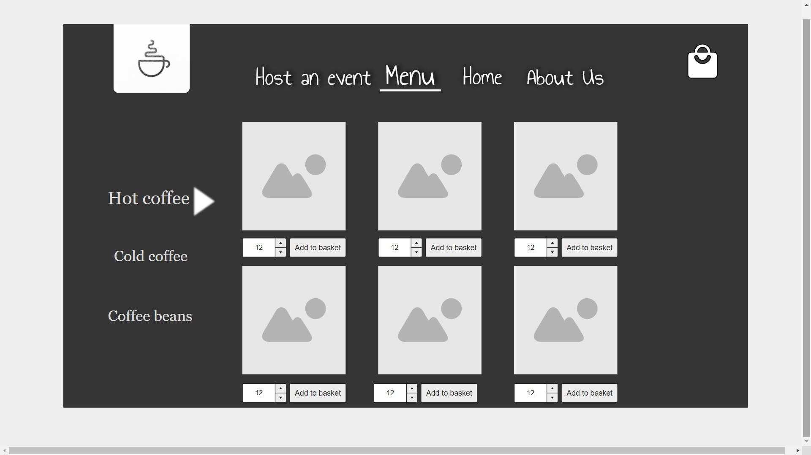
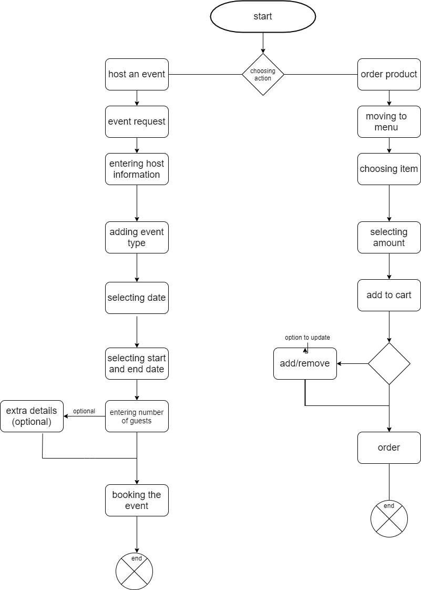

# system requirements 

## stage 1 : 1.1 : 

problem domain is the coffee shop web application , we talked with the stakeholder who wanted a coffee shop web app to improve their fame and to reach areas far beyond their cafe tables .

there are also the user requirements for example : 

+ users wanted to be able to order online , instead of going all the way to our cafe 
+ also needed our app to be user friendly and easy to use 
+ users also wanted to be able to book an event, giving its type and date , which helps the cafe prepare for the event as expected 

stakeholders wanted our app to be : 
+ easy to use and handle 
+ good quality coding 
+ and modern to attract more people 
+ able to add and remove product and update the site, like changing prices , or adding features or removing a whole branch if needed
+ map to show the users our locations 
+ small introduction about us to attract the users

## stage 1 : 1.2 : 

but that does not come easy, there are risks that i face and might happen in development such as : 

+ scope changes , it is possible that the stakeholders might change their scope , or wanting something else or opposite of what was first, for example changing the style from modern to old classic and so on..
+ end user not knowing how to handle the app , or not being comfortable with it , users will get used to using certain apps , so when moving to new ones they might not accept it if it was deferent, thats why it must be good quality, friendly , and some cozy vibes to attract the user 
+ not reaching the stakeholders expectations and the results they wanted
+ quality of the code, it will be huge problem and risk if not done right, for example having weird namings which makes it so hard to debug in case needed , also if the code was not dynamic , it will cause a lot of issues since it will need a lot of manual inputs and actions like adding a new product or removing it

## stage 1 : 1.3 : 

problem domain is the coffee shop web application , we talked with the stakeholder who wanted a coffee shop web app to improve their fame and to reach areas far beyond their cafe tables .

there are also the user requirements for example : 

+ users wanted to be able to order online , instead of going all the way to our cafe which is what most shops rely on now to get more and more profit , thus needing modern actions to grow bigger
+ also needed our app to be user friendly and easy to use since many people are still new to the internet , we needed the app to be user friendly, easy to use, good looking, everything the simple users need will be in front of them to order or seek information 
+ users also wanted to be able to book an event, giving its type and date , which helps the cafe prepare for the event as expected instead of going to the cafe to book and check if they can have the event, they can do it onine now!! with a whole page for booking the event , we will know how many guests , when , who is the host, and what type of event will it be , also any extra details too to be right ready for the event and meet the host and all guests expectations 

stakeholders wanted our app to be : 

+ easy to use and handle , like i said above , the app should be easy to use for the users , and now easy to use for the workers who will maintain it 
+ good quality coding, this one is very important, the code must be dynamic whereever needed , to garuntee working at peak and being able to meet the stakeholders expectations and be a flowless code 
+ and modern to attract more people modern look might attract more people , or sometimes classic styles do more , but what we can confirm , adding modern *features* and enhancing the app look and interface , weather in any style , it will always be good to attract new clients 
+ able to add and remove product and update the site, like changing prices , or adding features or removing a whole branch if needed , what if the cafe wants to expand? it will need an app that can handle that, thats why the app should give admins the access to delete or remove , add , change anything they need to expand the cafe and progress more 
+ map to show the users our locations , users should know where is our cafe branches to be able to visit
+ small introduction about us to attract the users , to make it a little more expert looking and to show we know what we are doing and how good is our quality 

wireframe : 

.jpg)

.jpg)
.jpg)
.jpg)

activity design : 

agile : 

[referenceWiki](https://en.wikipedia.org/wiki/Agile_software_development)

Agile (sometimes spelled Agile) is a collection of software development methods aimed at increasing the effectiveness of software development professionals, teams, and organizations. It entails self-organizing and cross-functional teams working together with their customers/end users to find requirements and build solutions (s). It promotes flexible reactions to changes in needs, resource availability, and knowledge of the issues to be solved, as well as adaptive planning, evolutionary development, early delivery, and continuous improvement.

